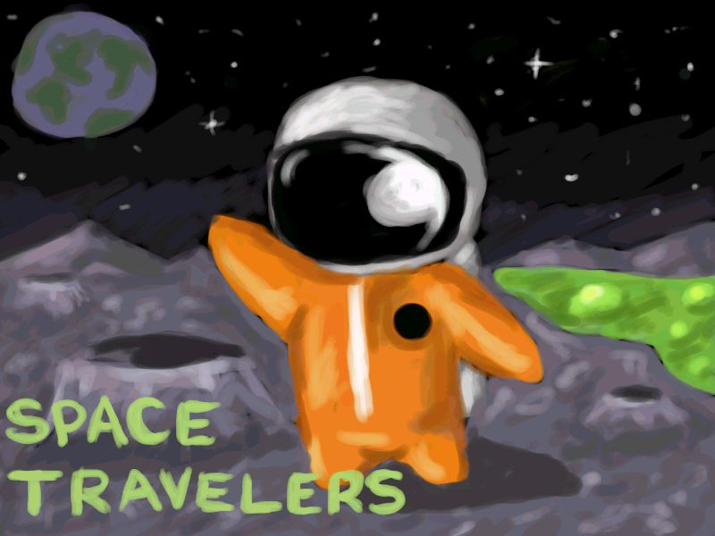

Originally posted to the fourth [72 hour game development competition](https://github.com/featherless/72hourgdc)
from December 17, 2004 to December 20, 2004.

[Download the submitted entry](https://github.com/72hourgdc-2004-december/SpaceTravellers/archive/submission.zip).

---

# About The Game

You need to guide the spacemen back to their ship, avoiding the deadly acid lakes.  Customize the world with direction markers to guide the spacemen home.  You only have a limited number of markers to place per level.  If a spaceman walks into a rock he will turn RIGHT.  Use that to your advantage when planning a route home.

You can either play campaign mode (which load level1.map.txt, level2.map.txt, level3.map.txt, etc if you want to add more levels onto the campaign), or just load an individual level to play.

# Credits

- **Programming** Alan Kemp
- **Art** Genius329

Contact** [72hrgdc@alankemp.com](mailto:72hrgdc@alankemp.com)

# Editor

There is a fully functional level editor built into the game.  It works in two parts, graphics and AI layers.  Use the buttons on the left to start a new level, load an existing level or save the current level (just saves, doesn't prompt for a new filename so back up your work :-) ).

When you start a new map you will be prompted to select a filename (if you chose an existing file it will be overwritten!).  Then you select the tileset to use.  At the moment there is only one tileset, so chose moon.tiles.bmp.

First lay down the graphics tiles for the level, make sure you put acid around the outside as you have to make sure the spacemen will never be able to get to the edge of the map.

Next click the "Layers: Graphics" button to toggle to the AI layer (you can press it again to toggle back if you want to do more work on the graphics layer).

Lay down the AI tiles on top of the graphics.  The tiles are, in order:

- Open space (spaceman can walk through this)
- Blocking (things like rocks, spacemen turn RIGHT when they encounter these)
- Start square (each one spawns a spaceman that must be got back to the ship, have as many as you like)
- End square (the spaceship.  You must only have ONE!  This isn't enforced in the editor, but it will break things if you place more than one)
- Death square (place over acid to kill spacemen)
- 4xArrows (you can place these in the editor if you want, these are the same arrows the player will be laying down)

**IMPORTANT:**

Once you create a new level and save it you need to open it in notepad and "fix" it.  First it will have saved the tilesheet name as a full path, change that to just the name of the tilesheet (so moon.tiles.bmp, strip off the path).

The second line of the level file is the number of arrows the player is allowed to place.  It defaults to 5, set it to how many you want the player to have.

# Libraries Used

- SDL
- SDL_image
- SDL_ttf
- <a href="http://skap.8k.com/">Storm GUI</a> (Source included straight into project, and quite heavily hacked)
